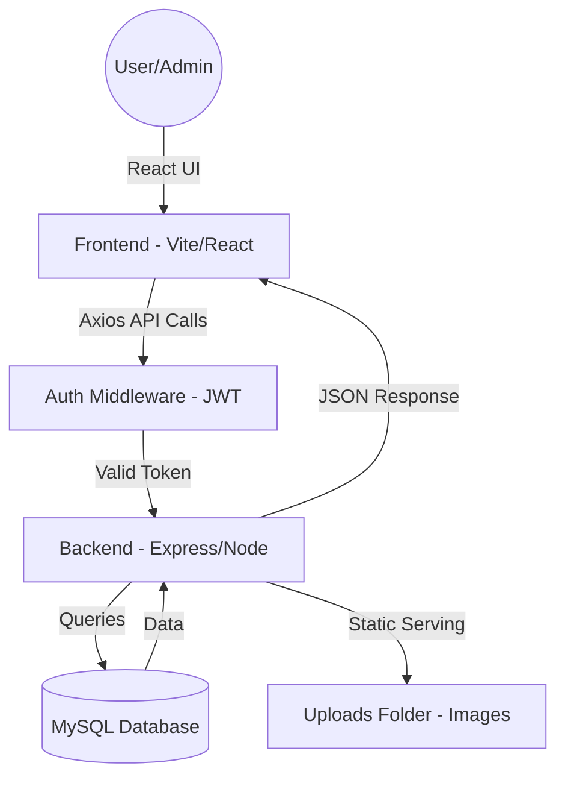

# ✨ LuxeCommerce - CodeAlpha E-commerce Project

A comprehensive e-commerce application featuring a modern React frontend, a robust Node.js/Express backend, and a standardized MySQL database.

---

## 🚀 Live Deployment
**Frontend & API**: [https://luxecommerce.onrender.com](https://luxecommerce.onrender.com)

---

## 🛠️ Technical Overview
LuxeCommerce is a modern, full-stack e-commerce platform built with a decoupled architecture.

### Languages & Frameworks
- **Frontend**: [React.js](https://react.dev/) (v19) with [Vite](https://vitejs.dev/)
- **Backend**: [Node.js](https://nodejs.org/) with [Express.js](https://expressjs.com/)
- **Database**: [MySQL](https://www.mysql.com/) (Standardized Uppercase Schema)
- **Styling**: Vanilla CSS with custom theme variables
- **State Management**: React Hooks (`useState`, `useEffect`) and LocalStorage for Auth/Cart persistence
- **Deployment**: [Render](https://render.com/)

---

## 🏗️ Project Structure
The project is organized into two primary root-level directories: `backend` and `client`.

### 📂 Backend Structure (`/backend`)
- `index.js`: Main entry point. Configures Middleware, Static Files, and API Routes.
- `setupDb.js`: Database initialization and seeding script.
- `controllers/`: Business logic for Users, Products, Cart, and Orders.
- `routes/`: API endpoint definitions.
- `middleware/`: JWT Auth and Multer configurations.

### 📂 Frontend Structure (`/client`)
- `App.jsx`: Main routing hub.
- `api/`: Centralized Axios instance and service functions.
- `features/`: Modularized logic for Auth, Products, and Users.
- `pages/`: Layout components (Home, About, Cart, Orders).
- `components/`: Reusable UI elements (`Navbar`, `Footer`).

---

## 🧩 Architectural Flow

---

## 🔑 Key Features
- **Authentication**: JWT-based secure login and registration.
- **Role-Based Access**: Specialized views for Administrators (User/Product management).
- **Product Management**: Full CRUD operations with image upload support.
- **Shopping Cart**: Persistent cart synchronized with the database.
- **SPA Compatibility**: Configured for seamless browser reloads on Render.

---

## 🛠️ Summary of Languages
| Area | Technologies |
| :--- | :--- |
| **Styling** | CSS3 (Variables, Flexbox, Grid) |
| **Logic** | JavaScript (ES6+), Node.js |
| **Data** | SQL (MySQL) |
| **Markup** | HTML5, JSX |